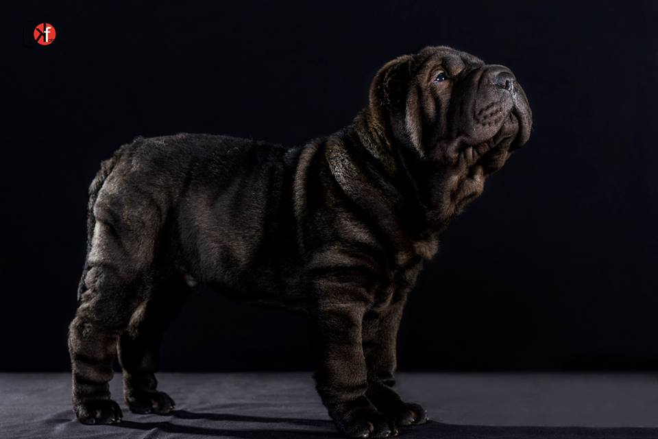

## Bienvenidos a la vida de un perro de pliegues!
# **Django**
## Sharpei americano nacido en Tomares hace cuatro años con mucho pelo negro

[WikiLink](https://es.wikipedia.org/wiki/Shar_Pei).
{
  "tada": "plays a fanfare :flags:",
  "nyan": "https://123.campfirenow.com/images/nyan.gif",
  "tmyk": ":sparkles: :star: The More You Know :sparkles: :star:",
  "rimshot": "plays a rimshot",
  "trombone": "plays a sad trombone",
  "crickets": "hears crickets chirping",
  "live": "is DOING IT LIVE",
  "greatjob": "https://123.campfirenow.com/images/greatjob.png",
  "yeah": "https://123.campfirenow.com/images/yeah.gif",
  "secret": "found a secret area :key:",
  "pushit": "https://123.campfirenow.com/images/pushit.gif",
  "drama": "https://123.campfirenow.com/images/drama.jpg",
  "vuvuzela": "======<() ~ ♪ ~♫"
}

<dl>
  <dt>Definition list</dt>
  <dd>Is something people use sometimes.</dd>

  <dt>Markdown in HTML</dt>
  <dd>Does *not* work **very** well. Use HTML <em>tags</em>.</dd>
</dl>

[

$img_canvas = Image::canvas(200, 200);
$img_canvas->fill(Image::make(''), 0, 0);
$img_canvas->fill(Image::make(''), 100, 0); // add offset
$img_canvas->fill(Image::make(''), 0, 100);
$img_canvas->fill(Image::make(''), 100, 100);
$img_canvas->save('img/canvas.png', 100);
